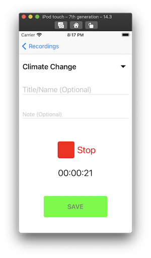

# Recorder Plus
An iOS app to record audio and organizes them in their respective groups.

## Description
This is an audio recorder app where users can quickly record audio and assign it more information like its name, description as well as group them into their own topic.

### Features
* Record/Playback Audio with cropping ability
* Group similar recordings together 
* Initiate recording from group
* Context menu to delete and edit recordings
* Quick recording
* Core Data to save audio recording information

### App Screenshots
 

### Usage
Open the app and tap on the "+" icon on the upper right, once you allow the app to use your device's microphone to conduct audio recording sessions, you can tap on the red Record button to start your first recording. Give it a topic, name, or note if you wish. By default, the recording's topic will be set to "Unknown".

If you need to quickly record something tap on the QuickRec to start a recording immediately and once done tap the SAVE button. By default, these recordings' topic will be set to "QuickRec".

### Run Locally
Before running this project in Xcode's simulator please note it requires the installation of some CocoaPods. To install the necessary CocoaPods navigate to the root of this project and execute the following in terminal:

`pod install`

Then make sure you run the project file with the .xcworkspace extension and NOT the file with .xcodeproj extension.

## Built With
* [Xcode - 12.3](https://developer.apple.com/xcode/) - The IDE used
* [Swift - 5.1.4](https://developer.apple.com/swift/) - Programming language
* [CocoaPods - 1.9.3](https://cocoapods.org/) - 3rd party dependencies

### CocoaPods
* [RangeSeekSlider](https://github.com/WorldDownTown/RangeSeekSlider)
* [iOSDropDown](https://cocoapods.org/pods/iOSDropDown)

## Author
* Cao Mai - [Portfolio](https://www.makeschool.com/portfolio/Cao-Mai)

## Note
